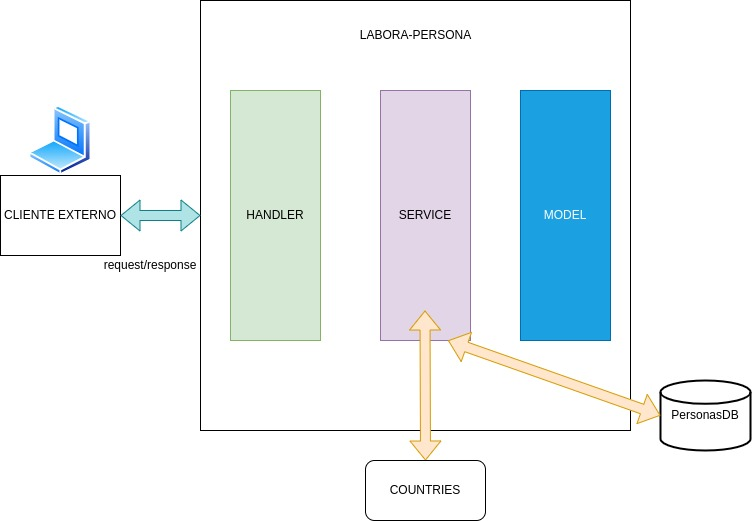
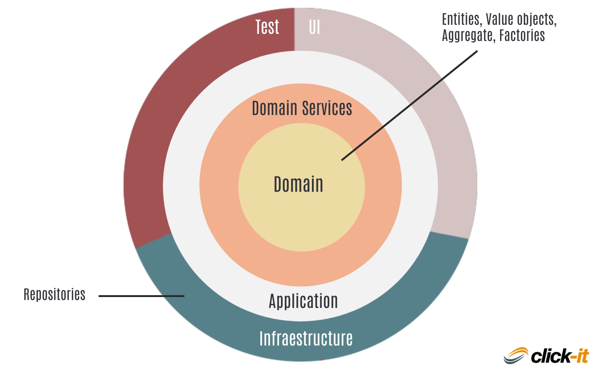

# LABORA API: Personas

**Introducción:**

En esta guía aprenderás a crear una API REST CRUD (Create, Read, Update, Delete) para gestionar "Personas" usando el lenguaje de programación Go sin usar una base de datos, almacenando la información en memoria.

Se podrá registrar una persona junto con su país en abreviatura, pero al momento de devolverlas, deberá hacerlo con la información completa de su país:

Nombre completo del país, Timezone y tipo de moneda.

Para realizar esto consultaremos a [restcountries](https://restcountries.com/).

<aside>
📑 **Comportamiento**: La `Persona` no puede tener los datos sin valores.

</aside>



# Hitos

Podemos llevar a cabo nuestra aplicación en los siguientes hitos:

- **Creación del core**, nuestro modelo persona junto con su comportamiento.
- **Creación del servicios**, que sería información de la lógica de nuestra aplicación (operaciones CRUD y llamadas externas).
- **Creación de infraestructura**, como vamos a consumir externamente nuestra aplicación, en esste caso servidor junto con sus handlers.

Esto de forma muy sencilla es DDD:



**Pasos:**

**1. Crear el proyecto:**

- Abre tu terminal y navega a la carpeta donde deseas crear el proyecto.
- Ejecuta el siguiente comando:

```go
go mod init labora-persona
```

**2. Definir la estructura de la persona:**

- Crea un archivo `models/persona.go` y define la siguiente estructura:

```go
type Persona struct {
  ID int
  Nombre string
  Apellido string
  Edad int
	País string
}

// Comportamiento de la Persona..
func (p Persona) Validate() bool 
```


### 3. Crear un slice para almacenar las personas

- En el archivo `main.go` crea un slice de tipo `Persona` para almacenar las personas:

```go
var PersonasDb []Persona
```

### 4. Podremos comenzar con `createPersona` de nuestro servicio

```go
func insertarPersonaEnLaDb(persona Persona) int {
	// Incrementar el ID de la persona
	persona.ID = len(PersonasDB) + 1
	PersonasDB = append(PersonasDB, persona)
	return persona.ID
}

// Resto de operaciones crud
func editarPersonaEnLaDb(persona Persona) err
//...
```

### 5. Llamada a servicio externo

Aquí irá la magía, deberiamos crear una struct para contemplar este nueva “Persona Extendida Con Su País” en donde deberá contar con la información ya mencionada.

### 6. Crear handlers en un archivo `handlers.go`

<aside>
💡 No vamos a necesitar una librería externa, en go1.22 [tenemos sorpresas!](https://tip.golang.org/doc/go1.22#enhanced_routing_patterns)

</aside>

```go
func createPersona(w http.ResponseWriter, r *http.Request) {
	// Aquí implementa la lógica para crear una persona específica
}

func getPersona(w http.ResponseWriter, r *http.Request) {
	// Aquí implementa la lógica para obtener una persona específica
}

func updatePersona(w http.ResponseWriter, r *http.Request) {
	// Aquí implementa la lógica para actualizar una persona
}

func deletePersona(w http.ResponseWriter, r *http.Request) {
	// Aquí implementa la lógica para eliminar una persona
}
```

# PT2: Conectar DB

### Introducción

*Una colección de una o más sentencias SQL que se comunican con una base de datos se conoce como **transacción SQL*** . Una transacción en una tabla es, por ejemplo, cuando se *agrega* , *actualiza* o *elimina* un registro de ella. Las transacciones en SQL son *cruciales para preservar la integridad de la base de datos* en casos de ejecución simultánea de múltiples operaciones relacionadas o interacciones simultáneas con la base de datos. Cada transacción comienza con una tarea particular y finaliza cuando todas las tareas del grupo se completan con éxito. **Un error en una sola tarea provoca que falle toda la transacción** . Por lo tanto, una transacción sólo puede tener uno de dos resultados: *éxito* o *fracaso.*


# **Propiedades de las transacciones SQL**

Por definición, una transacción de base de datos debe ser *atómica, consistente, aislada* y *duradera* . La abreviatura Éstas se denominan frecuentemente **propiedades ACID** .

- Atomicidad : esta propiedad garantiza la finalización exitosa de todas las tareas dentro de la unidad de trabajo. Entonces, en caso de que alguna tarea falle, todas las operaciones anteriores se revierten a sus estados iniciales y la transacción se cancela en el punto del fallo.
- Consistencia : esta propiedad garantiza que después de una transacción confirmada exitosa, los estados de la base de datos cambien de manera adecuada.
- Aislamiento : esta propiedad permite que las transacciones funcionen de forma transparente e independiente unas de otras.
- Durabilidad : esta propiedad garantiza que el resultado o el impacto de una transacción comprometida perdure en caso de un mal funcionamiento del sistema .

**BEGIN TRANSACTION** – This command marks the start of each transaction.
**COMMIT** – This command saves the changes to the database in a permanent manner.
**ROLLBACK** – This command reverses any modifications, returning them to their original condition.
**SAVEPOINT** – this command enables us to roll back transactions in parts rather than all at once by establishing points within groups of transactions.
**RELEASE SAVEPOINT** – This command is used to delete an existing SAVEPOINT.

# **Ejemplos de transacciones**

Para los siguientes dos *ejemplos* de transacciones SQL, usaremos la *siguiente tabla:*


# **Ejemplo de confirmación**

Entonces, los *pasos y comandos* que debemos seguir y escribir *al crear una transacción COMMIT* son: 1. **BEGIN TRANSACTION** para iniciar la transacción 2. Varias declaraciones SQL como **INSERT, UPDATE** … 3. Comando **COMMIT** para finalizar la transacción y guardar los cambios.

Mirá el siguiente *ejemplo* donde *insertamos un nuevo pedido* en la tabla que se muestra arriba y también *actualizamos la cantidad de artículos pedidos de un pedido ya existente* en la base de datos:

**COMMIT**

```sql
-- Start the transaction    
BEGIN TRANSACTION  
-- SQL Statements  
 INSERT INTO Table2 VALUES(15, 8112, 2021-11-12, ‘Nadia’, ‘Female’, Stuttgart, Germany, 17, 7)  
 UPDATE Table2 SET NumberOfItems = 5 WHERE CustomerID = 2  
 -- Commit changes   
COMMIT TRANSACTION  
```

**ROLLBACK**

```sql
-- Start the new transaction    
BEGIN TRANSACTION  
-- SQL Statements  
 DELETE FROM Table2 WHERE Age > 40
 -- undo changes   
ROLLBACK TRANSACTION  
```


### Sentencia de creación sql

```sql
CREATE DATABASE personas;
```

Creación de tabla

```sql
-- Script para crear la tabla "personas"
CREATE TABLE personas (
    id SERIAL PRIMARY KEY,
    nombre VARCHAR(100) NOT NULL,
    apellido VARCHAR(100) NOT NULL,
    edad INTEGER NOT NULL,
    country_code VARCHAR(10) NOT NULL
);
```

**Configurar la conexión a PostgreSQL en tu aplicación Go**:

- Primero, necesitarás importar el paquete **`database/sql`** y el driver PostgreSQL para Go. Puedes hacerlo mediante el comando **`go get`**:

```go
go get github.com/lib/pq
```

- Luego, establece la conexión en tu código. Debes proporcionar la información de conexión necesaria, como el `nombre de usuario`, la `contraseña`, el `nombre de la base de datos` y el `host`. Aquí tienes un ejemplo de cómo hacerlo:

```go
import (
    "database/sql"
    _ "github.com/lib/pq"
)

func main() {
    // Configurar la conexión a PostgreSQL
    db, err := sql.Open("postgres", "user=youruser dbname=yourdb password=yourpassword host=localhost sslmode=disable")
    if err != nil {
        // Manejar el error si la conexión falla
        panic(err)
    }
    defer db.Close()
}

```

<aside>
💡 **`Open`**: El método **`Open`** se utiliza para establecer una conexión con la base de datos. En este paso, se realizan varias tareas importantes, como la inicialización de la conexión y la autenticación con el servidor de la base de datos. Este paso es esencial para poder realizar consultas y otras operaciones en la base de datos.

**`Close`**: El método **`Close`** se utiliza para cerrar la conexión con la base de datos. Cuando ya no necesitamos interactuar con la base de datos, es importante cerrar la conexión para liberar los recursos asociados con ella.

</aside>